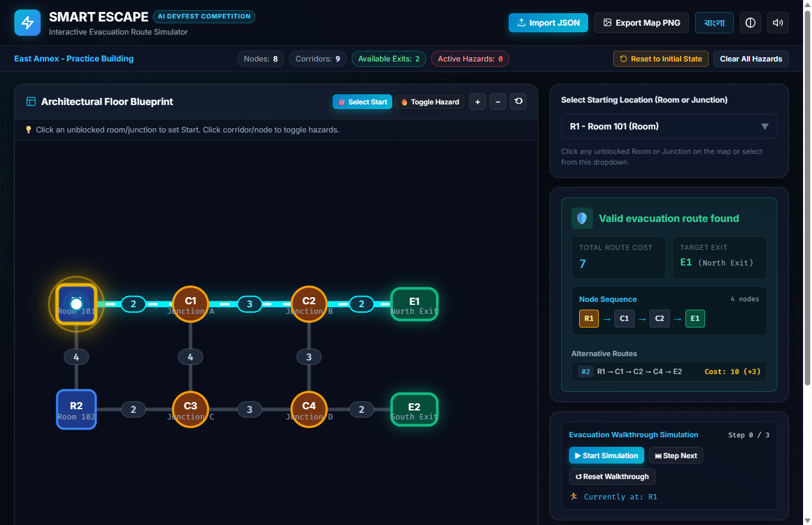
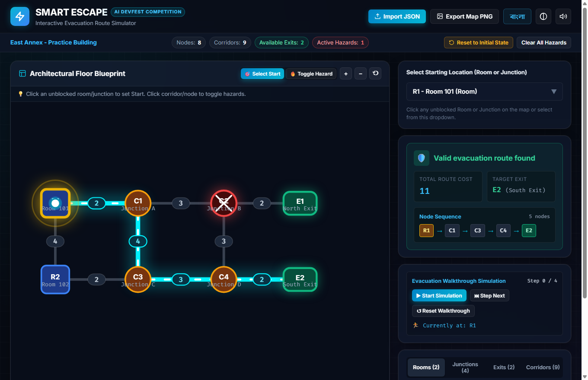
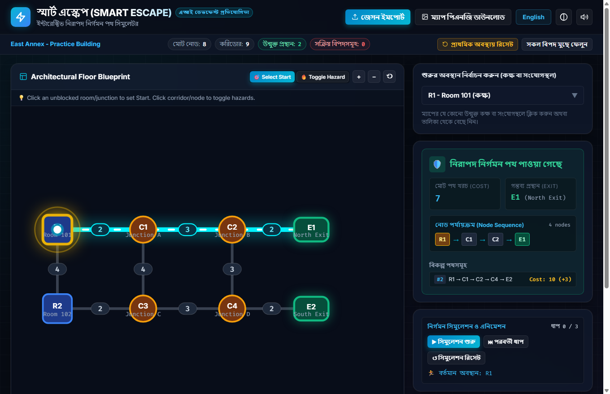

# Smart Escape - Interactive Evacuation Route Simulator
> **AI DevFest Practice Challenge Submission**  
> *A high-performance, frontend-only evacuation simulator with real-time dynamic hazard recalculation, Dijkstra pathfinding with strict tie-breaking, and bilingual support (English & Bangla).*



---

## 📌 Deliverable Information

- **Participant Name**: Md Asfir Ahammed Afif
- **Registration Number**: `cmu1fw6vz0232o0kn16ki93wp`
- **GitHub Repository**: [https://github.com/mdasfirahammedafif/devfest-cmu1fw6vz0232o0kn16ki93wp](https://github.com/mdasfirahammedafif/devfest-cmu1fw6vz0232o0kn16ki93wp)
- **Live Website Demo**: [https://mdasfirahammedafif.github.io/devfest-cmu1fw6vz0232o0kn16ki93wp/](https://mdasfirahammedafif.github.io/devfest-cmu1fw6vz0232o0kn16ki93wp/)
- **License**: [MIT License](LICENSE)

---

## 🚀 Live Demonstration & Features

### 🌟 Key Implemented Features

1. **Local JSON Import & Strict Schema Validation**:
   - Imports building datasets directly in the browser via file picker or drag-and-drop.
   - Strictly validates 2–60 nodes, 1–150 undirected positive-cost edges, node types (`room`, `junction`, `exit`), coordinate ranges, self-loop prevention, duplicate edge elimination, and `initial_state` categoric consistency.
   - Friendly, clear bilingual validation error reporting dialog.

2. **Exact Dijkstra Routing & Tie-Breaking**:
   - Calculates path cost strictly as the sum of corridor edge weights.
   - Automatically excludes blocked rooms/junctions, incident edges, blocked corridors, and closed exits.
   - **Deterministic Tie-Breaking (Section 3.3)**:
     1. Minimum total cost.
     2. On equal cost: Lexicographically smallest exit ID (e.g. `E1` < `E2`).
     3. On path ties to that exit: Lexicographically smallest sequence of node IDs.
   - Handles all edge cases:
     - `Starting location blocked` when the chosen start node is engulfed in hazard.
     - `No route available` when all exits are unreachable or cut off.

3. **Interactive Visual Blueprint (SVG)**:
   - Responsive vector map rendering with distinct geometries:
     - **Rooms**: Rounded squares with door icons and label badges.
     - **Junctions**: Connector hubs.
     - **Exits**: High-visibility emergency green exit pills.
   - Corridor cost pills placed at edge midpoints.
   - **Visual Hazard Markers**:
     - Blocked nodes: Red hazard overlay with luminous glow and hazard cross.
     - Closed exits: Barred dark red indicators.
     - Blocked corridors: Dashed red lines with warning markers.
     - Active Route: Glowing cyan animated pulse with flowing directional dashes.
   - Smooth Pan & Zoom canvas with zoom reset and centering controls.

4. **Instant Reactivity & Hazard Management**:
   - Click any room or junction to set it as Start, or toggle hazards.
   - Click exits to open/close them.
   - Click corridors or corridor cost pills to block/unblock.
   - Dedicated **Hazard Management Panel** categorized by Rooms, Junctions, Exits, and Corridors with real-time search filtering.
   - One-click **Reset to Initial State** restoring `initial_state` from the file.

5. **Bilingual Localization (English & বাংলা)**:
   - Complete, authentic translation switch between English and natural Bengali (বাংলা).
   - Covers all headers, buttons, metric labels, instructions, statuses, errors, and walkthrough messages.

6. **Bonus Extensions (Section 4.2)**:
   - **Evacuation Walkthrough Simulator**: Animated moving beacon traversing node-by-node from start to exit with Play/Pause, Step-by-Step, and speed controls.
   - **Alternative Routes Viewer**: Computes and highlights secondary viable evacuation paths with cost deltas.
   - **High-Contrast Accessibility Mode**: WCAG AAA high-contrast theme for low-vision users.
   - **PNG Map Export**: Instant high-resolution 2x retina PNG screenshot export with timestamp and building title watermark.
   - **Synthesized Web Audio**: Built-in Web Audio API sound feedback (success chime, hazard alert beep, subtle click) with mute toggle.
   - **Deep-Linking URL Parameters**: Supports query parameters for instant automated testing (e.g., `?start=R1&block=C2&lang=bn`).
   - **Built-in Sample Checks Verifier**: In-app modal that runs all Section 4.1 test cases with 1-click verification.

---

## 🧪 Official Sample Checks (Section 4.1)

All 5 required competition test cases pass with 100% accuracy:

| Scenario | Action | Expected Result | Actual Result | Status |
| :--- | :--- | :--- | :--- | :---: |
| **1. Baseline** | Select `R1` | `R1 - C1 - C2 - E1; cost 7` | `R1 - C1 - C2 - E1; cost 7` | ✅ **PASSED** |
| **2. Blocked junction** | Select `R1`; block `C2` | `R1 - C1 - C3 - C4 - E2; cost 11` | `R1 - C1 - C3 - C4 - E2; cost 11` | ✅ **PASSED** |
| **3. Exits closed** | Select `R1`; close `E1` and `E2` | `No route available` | `No route available` | ✅ **PASSED** |
| **4. Different start** | Select `R2` | `R2 - C3 - C4 - E2; cost 7` | `R2 - C3 - C4 - E2; cost 7` | ✅ **PASSED** |
| **5. Blocked start** | Select `R1`; then block `R1` | `Starting location blocked` | `Starting location blocked` | ✅ **PASSED** |

To run the automated test suite in Node.js:
```bash
node scripts/verify_sample_checks.js
```

---

## 📷 Screenshots

### 1. Baseline Evacuation Route (`R1 → E1`, Cost: 7)


### 2. Dynamic Rerouting after Blocking Junction C2 (`R1 → E2`, Cost: 11)


### 3. Full Bengali (বাংলা) Localization Mode


---

## 🛠️ Technology Stack & Architecture

- **Core**: Vanilla JavaScript (ES Modules), HTML5 SVG, Vanilla CSS (Design Tokens, Glassmorphism).
- **Bundler & Dev Server**: Vite 6.
- **Audio Engine**: Native Web Audio API (zero external assets).
- **Deployment**: Static build output in `dist/` compatible with GitHub Pages, Vercel, Netlify, or Cloudflare Pages with zero backend required.

### Project Structure
```
.
├── LICENSE                          # MIT License
├── README.md                        # Documentation & verification report
├── index.html                       # Semantic HTML5 entrypoint
├── package.json                     # Project manifest and scripts
├── vite.config.js                   # Vite configuration (relative base for all hosts)
├── public/
│   └── building.json                # Sample dataset (East Annex)
├── screenshots/
│   ├── baseline_route.png           # Deliverable: Baseline route
│   ├── rerouting_blocked_c2.png     # Deliverable: Rerouting after C2 blocked
│   └── bangla_mode.png              # Deliverable: Bangla mode
├── scripts/
│   ├── verify_sample_checks.js      # Automated unit test suite for Section 4.1
│   └── take_screenshot.js           # Headless screenshot utility
└── src/
    ├── main.js                      # Application controller & SVG rendering
    ├── data/
    │   └── defaultBuilding.js       # Embedded fallback building data
    ├── styles/
    │   └── main.css                 # Glassmorphic responsive design system
    └── utils/
        ├── audio.js                 # Web Audio synthesizer
        ├── exportPng.js             # SVG-to-Canvas PNG exporter
        ├── i18n.js                  # English & Bangla localization dictionaries
        ├── router.js                # Exact Dijkstra pathfinding & tie-breaker
        └── validator.js             # Strict JSON schema validator
```

---

## 💻 Running Instructions

### Prerequisites
- Node.js (v18 or higher recommended)
- npm (v9 or higher)

### 1. Install Dependencies
```bash
npm install
```

### 2. Run Local Development Server
```bash
npm run dev
```
Open `http://localhost:5173` in any modern web browser (Google Chrome recommended).

### 3. Build Production Bundle
```bash
npm run build
```
The optimized static bundle is generated in the `dist/` folder, ready for deployment.

### 4. Deploying to GitHub Pages / Vercel / Netlify
- **Vercel / Netlify**: Simply link your GitHub repository. The build command is `npm run build` and publish directory is `dist`.
- **GitHub Pages**:
  1. In repository settings, navigate to **Pages**.
  2. Select **GitHub Actions** or deploy from `gh-pages` branch.
  3. The `base: './'` configuration in `vite.config.js` ensures assets resolve properly under repository subpaths.

---

## 🤖 AI Tools & Prompts Used

- **AI Tools**: Antigravity IDE (powered by DeepMind Gemini models).
- **Most Useful Prompt**:
  > *"Analyze the AI DevFest Smart Escape problem statement and building.json schema. Implement an interactive browser-based evacuation simulator using Dijkstra's algorithm with strict tie-breaking (minimum cost, smallest exit ID, smallest sequence of node IDs). Include real-time hazard toggling, start selection, failure handling ('Starting location blocked' and 'No route available'), full English and Bangla localization, and animated vector map visualization."*

---

## ⚖️ License

Distributed under the [MIT License](LICENSE).
